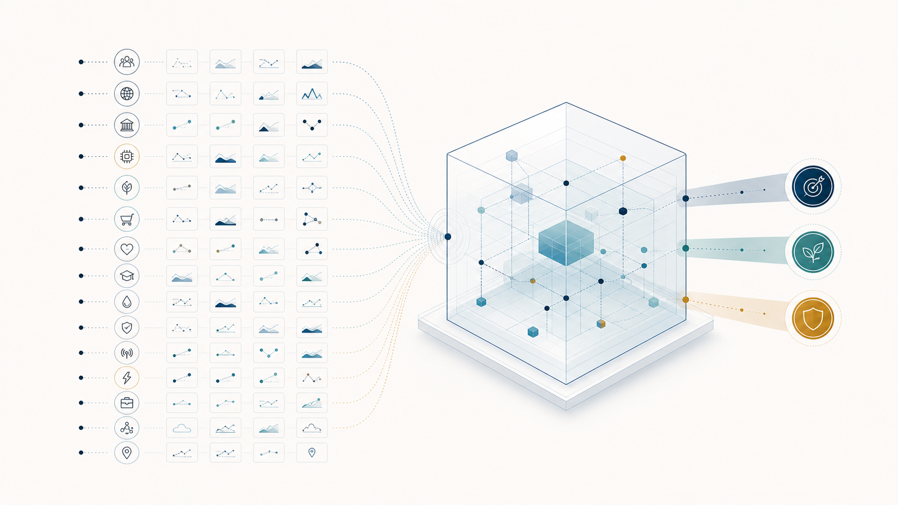

# Super-scenarios: 100x foresight

*Why generative AI makes it feasible to run not 3–5 scenarios per project, but hundreds — and what that unlocks.*

Current foresight-backgrounded scenario work usually proceeds on creating 2–5 scenarios per scenario project. This approach is largely grounded in history, and is a reasonable approach from the existing conditions the field has operated in since its inception, roughly 50 years ago at Shell.

## The limits of today's scenario work

Foresight as it stands is manual, expert-heavy work that has seen very few changes from traditional ML/AI approaches, especially for the Shell-style scenario work. This largely stems from the limitations of traditional ML/AI and statistical methods, which have great value in the field of forecasting, where they excel at making forecasts about how variations in current conditions could materialize in the coming years. However, the weakness of this approach is that it's largely unable to account for significant changes to the status quo, or large variances in material conditions. For example, things like pandemics, rapid technological developments, unforeseen global conflicts or geopolitical changes.

This is the area of foresight, which as a field is significantly more capable of handling the uncertainty and unpredictability of the modern world (and by extension the operating environment of most businesses).

Scenario methodologies themselves vary widely, but most methodologies focus on isolating a certain set of key-drivers, around which the scenarios are constructed. The number of drivers most teams can grapple with, with any rigour, is typically limited to between 4-15 at most, as the complexity of the solution space tends to increase exponentially, and anything above 8 drivers usually tends to become peripheral or given only surface-level attention. On the other hand, we know that the real world is significantly more complex, and this is a challenge that scenarios often have to contend with. Even at reduced resolution, the complexity of the real world is difficult to grapple with or model at any reasonable accuracy. The current methodology does admirably with the difficulty of the challenge though, is often undervalued relative to its potential impact, and has been able to achieve some real victories in the field of foresight — for instance, Shell's scenario work is widely credited with preparing the company for the 1973 oil shock and, later, the 1986 oil-price collapse.

## The case for casting a wider net

That said, there are many cases, where the needs of strategic foresight (foresight applied more directly to business or strategy needs of an organization, institution or an actor) genuinely require casting a wider net. A power company, for example, might have stakeholders at just about every level of society. Any scenario exercise attempting to cover every area of concern would frankly have to contend with choosing a few, or a very compressed view at most, or treating these at an aggregate demand / output level. As most scenario exercises do.

The issue with this, however, is that it often fails to account for things happening at the level of individual stakeholder industries or domains. A good example being the current AI / data center infrastructure boom, where energy is quickly becoming a bottleneck. A careful scenario exercise on compute demand for AI inference and training could've predicted a massive increase in power demand, but would have required a separate exercise. Similarly, looking a few years back, modeling the geopolitical situation in eastern Europe could have, as one scenario, identified an expansionist Russia (the early signals for which started emerging back in 2008 with the Russo-Georgian War, or by the 2014 annexation of Crimea at the latest) that would attempt to wage war on Europe, and highlighted the energy dependence of Europe on Russia's gas and oil imports, therefore identifying a vulnerability in the supply chain that would have significant impact on energy prices.

The problem is, of course, that you'd have either needed to know ahead of time where to look, or alternatively have run 100s of scenario exercises to identify these vulnerabilities and their chains, an exercise that would have required either supernatural powers of foresight, or 1000s of analysts working full time on the problem.

## What generative AI changes

However, with Gen AI's maturity, this equation is finally changing. While Gen AI can't still quite operate at the level of the most experienced foresight experts, its ability to follow established methodologies and workflows has reached the mid-level practitioner level for the analytical work itself. While it's far from plug-and-play ("ChatGPT, create three scenarios on global energy demand"), and requires thoughtful design and R&D from the firms to codify and operationalize best practices in a form that Gen AI is actually capable of using and interacting with, this level of workflow automation and augmentation is completely achievable, and something we've been able to show is possible at Capful.

## Constructing super-scenarios

This then, means that scaling scenarios up from the current 3-5, to something that could be called 100x foresight, is suddenly quite feasible. A process of first identifying and mapping each significant stakeholder party for an organization (a number likely between 10 – 100), could produce a set of scenarios for each stakeholder domain, and construct super-scenarios. These could be modeled both at the super-scenario level, and the level of individual stakeholder scenarios, against an organization's strategic digital twin, to identify a narrow set of the most critical impacts, the strongest business opportunities, and the most significant vulnerabilities, with full traceability chains.

## Why it scales — and the remaining bottleneck

The beauty of the model is that it actually scales quite seamlessly from strong fundamentals. The difficulty of the model is in fact getting the core process right, but from there it moves quite seamlessly to 10, 100 or 500 scenario sets constructed, with the only real scalars being inference costs and the bandwidth for analyzing the produced information. The latter though, mostly requires foresight to solve one of its longer-standing issues, of the current atomistic unit being significantly too large in its bandwidth requirements, and producing bite-sized chunks that organization leaders can more effectively grapple with.
