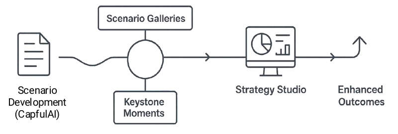
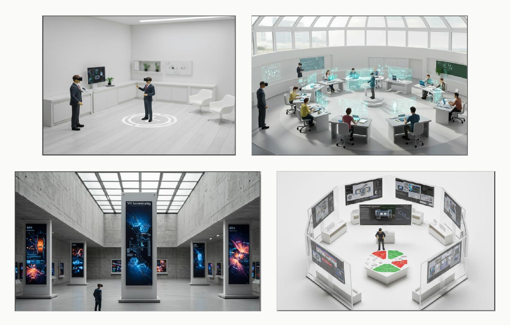
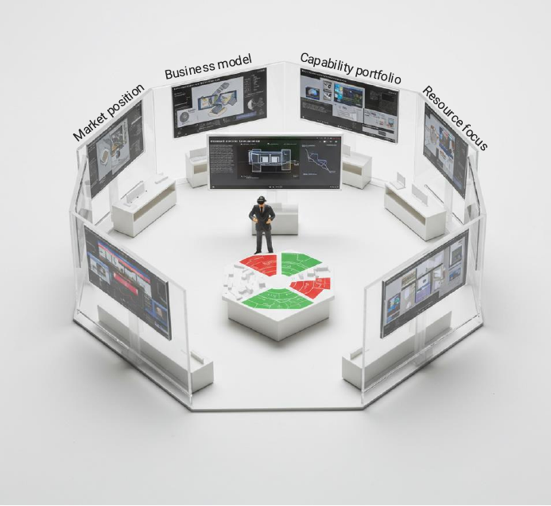
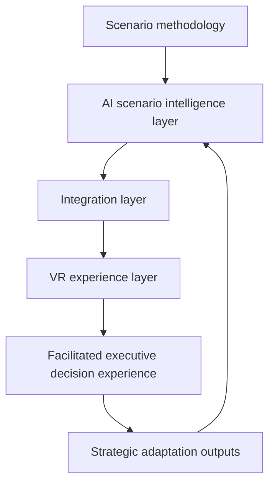
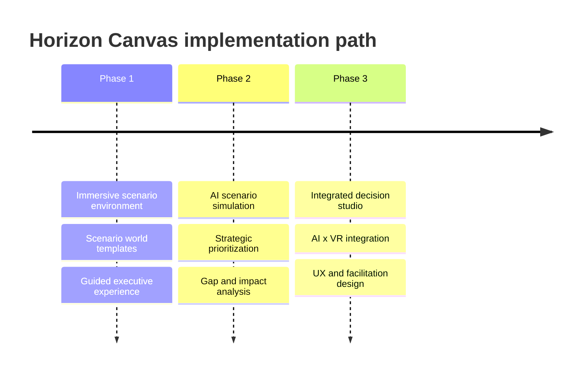

# Horizon Canvas

## AI x VR-Augmented Foresight For Strategic Decision-Making

**Type:** Solution concept  
**Status:** Public-safe portfolio writeup. The concept is described at the level of solution architecture, user experience, and method. Proposal-specific partner details, commercial terms, and implementation-sensitive material are intentionally omitted.

## Concept

Horizon Canvas is an AI x VR-augmented foresight concept for executive decision-making.

The idea is simple: strategic scenarios are more useful when leadership teams can experience them and test choices inside them, not only read about them. Horizon Canvas turns scenario work into an immersive decision environment where executives explore alternative futures, identify strategic gaps, test decisions across multiple scenarios, and use AI-supported impact analysis to translate foresight into action.

I developed the concept as a response to a recurring limitation in foresight work: high-quality scenarios can still fail to change executive decisions if they remain abstract. The issue is rarely that the scenario logic is weak. The issue is that decision-makers often do not engage deeply enough with the implications to adapt strategy.

Horizon Canvas addresses that gap by combining:

- **Foresight methodology** for scenario logic, uncertainty, implications, and strategic adaptation.
- **Generative AI** for scenario intelligence, strategic dimension mapping, gap analysis, and impact analysis.
- **VR environments** for immersion, spatial memory, and experiential engagement.
- **Facilitated decision design** to connect the experience back to concrete strategic choices.

## Concept Visual

## The Problem

Traditional foresight often breaks down at the last mile between analysis and action.

Scenario projects can produce strong narratives, robust uncertainty analysis, and useful implications, but executive teams may still struggle to internalize what those futures require. Reports and slide decks are efficient ways to communicate information, but they are weaker at creating lived engagement with a future context.

Common failure modes:

- Scenarios are consumed passively.
- Decision-makers engage with only part of the material.
- Abstract future conditions do not translate into current choices.
- Strategic implications remain interesting but operationally distant.
- Leadership teams do not systematically test decisions across futures.
- Existing strategy remains anchored in the present because the alternative futures do not feel concrete enough.

The core problem is not scenario generation. It is decision engagement.

## Solution Shape

Horizon Canvas converts scenario work into an immersive decision studio.

Instead of treating scenarios as static outputs, the concept turns them into interactive environments. A leadership team enters a facilitated scenario space, experiences the conditions of alternative futures, prioritizes strategic dimensions, and tests decisions against those futures.

The experience is structured around a clear decision flow:

1. **Guided orientation**  
   The team enters the experience with minimal technical friction. The setup is facilitator-managed so executives can focus on strategy rather than hardware.

2. **Scenario world exploration**  
   Each scenario becomes a spatial environment. The team encounters signals, constraints, stakeholder shifts, market changes, regulation, capability pressures, and emerging opportunities inside the world.

3. **Strategic dimension prioritization**  
   The team identifies which parts of the strategy are most exposed: business model, market position, capability portfolio, resource focus, operating model, resilience, ecosystem, or investment priorities.

4. **Decision testing**  
   Candidate strategic choices are tested across multiple futures. The goal is to reveal which choices are robust, which are scenario-dependent, and which create new vulnerabilities.

5. **AI-supported impact analysis**  
   Generative AI structures the implications: positive and negative consequences, assumption dependencies, second-order effects, cross-scenario vulnerabilities, and adaptation options.

6. **Strategic adaptation**  
   The session produces decision inputs: robust moves, contingent moves, warning indicators, capability gaps, and next-step actions.

## User Experience Journey

The journey moves from low-friction orientation into scenario exploration and then into decision testing. The VR layer is not there for spectacle. It gives scenario work a spatial and experiential form, making future conditions easier to remember, discuss, and act on.

## Decision Simulation Method

Horizon Canvas is designed around decision simulation, not only scenario presentation.

The method has three core layers:

1. **Strategic dimension prioritization**  
   The team selects the dimensions most critical to success under uncertainty.

2. **Strategic gap analysis**  
   Immersive scenario engagement helps reveal where current strategy, capabilities, or assumptions become insufficient.

3. **AI impact analysis**  
   Strategic decisions are evaluated across alternative futures, showing where choices produce positive effects, negative consequences, dependencies, and vulnerabilities.

This is the central design move: the immersive environment is connected to a structured strategy method. The output is not simply "people experienced the future." The output is a better understanding of what the organization should protect, change, test, or monitor.

## Architecture

The concept separates the intelligence layer from the experience layer.

### Scenario Methodology

The foundation is established foresight practice: scenario logic, uncertainties, implications, strategic options, and decision support.

### AI Scenario Intelligence Layer

The AI layer handles scenario structuring and analysis. It supports strategic dimension mapping, gap analysis, impact analysis, cross-scenario comparison, and organization-specific adaptation.

### VR Experience Layer

The VR layer translates future worlds into immersive environments. It creates spatial context, guided exploration, scenario galleries, keystone moments, and decision-testing spaces.

### Integration Layer

The integration layer connects scenario content, AI analysis, and immersive experience. Scenario data flows into the VR environment; user choices and decision inputs flow back into the analysis layer.

### Facilitated Decision Experience

The experience is designed as a facilitated executive intervention. The technology supports strategic work; it does not replace the method or the facilitator.

## Why AI And VR Belong Together Here

AI and VR solve different parts of the foresight engagement problem.

AI makes the scenario system adaptive:

- It structures scenario worlds.
- It connects future conditions to strategic dimensions.
- It helps identify gaps and implications.
- It supports rapid iteration.
- It compares decisions across futures.

VR makes the scenario system experiential:

- It turns abstract futures into places.
- It increases attention and recall.
- It gives leadership teams a shared environment for discussing uncertainty.
- It makes trade-offs more concrete.

Used separately, either technology is incomplete. VR without AI risks becoming a static exhibition. AI without immersive design risks remaining another text-based analysis layer. Together, they create a stronger bridge from foresight to decision-making.

## Implementation Path

Horizon Canvas is designed for phased development.

1. **Immersive scenario environment**  
   Build the first scenario world, interaction pattern, visual language, facilitation flow, and content templates.

2. **AI scenario simulation**  
   Add AI-supported strategic prioritization, gap analysis, and decision-impact analysis.

3. **Integrated decision studio**  
   Connect the AI and VR layers into a coherent executive workflow with UX, facilitation design, and reusable outputs.

## Design Principles

### Make Futures Concrete

Scenario work should become easier to experience, remember, and discuss. The point is not visual richness by itself; it is stronger strategic engagement.

### Keep The Method In Charge

The foresight method remains the backbone. AI and VR are used to strengthen the method, not replace it.

### Minimize Technical Friction

The experience should be facilitator-managed and executive-ready. Users should not have to configure technology or learn complex controls.

### Ground AI In Scenario Logic

AI should operate inside the scenario frame. Its job is to structure implications, compare choices, and expose assumptions, not invent disconnected advice.

### Translate Experience Into Decisions

Every immersive moment should connect back to strategic adaptation: what to do, what to monitor, what to test, and what assumptions need to change.

## Example Use Cases

Horizon Canvas fits situations where organizations need to make strategic decisions under uncertainty:

- Stress-testing a new strategy against alternative operating environments.
- Exploring how regulation, geopolitics, technology, or market structure could reshape strategic choices.
- Helping leadership teams internalize customer, stakeholder, or market shifts.
- Testing investment priorities across several futures.
- Supporting public-sector planning where long-term trade-offs are difficult to communicate.
- Translating scenario work into capability, portfolio, or operating-model decisions.

## What The Concept Shows

Horizon Canvas shows one direction for the next generation of foresight practice: moving from scenario communication toward scenario experience and decision simulation.

The concept demonstrates that AI can be used not only to generate more foresight content, but to make scenarios more adaptive, organization-specific, and decision-relevant. It also shows how immersive technologies can be used in a serious strategic context when they are tied to a clear method rather than treated as novelty.

The underlying idea is broader than VR. Strategic foresight needs better interfaces for decision-making. Horizon Canvas is one version of that interface: a decision studio where leadership teams can inhabit futures, test choices, and leave with clearer strategic commitments.

## Public Summary

Horizon Canvas is an AI x VR foresight solution concept for executive decision-making. It turns scenario work into an immersive decision studio where leadership teams can experience alternative futures, test strategic choices, and use AI-supported impact analysis to identify robust moves, vulnerabilities, and adaptation needs. The concept combines foresight methodology, generative AI scenario intelligence, VR experience design, and a phased implementation architecture.
