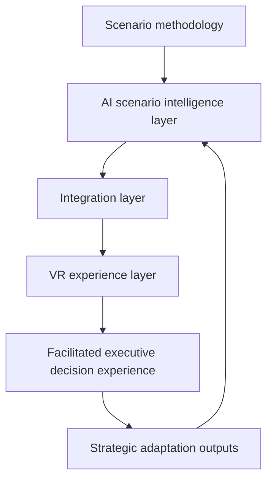
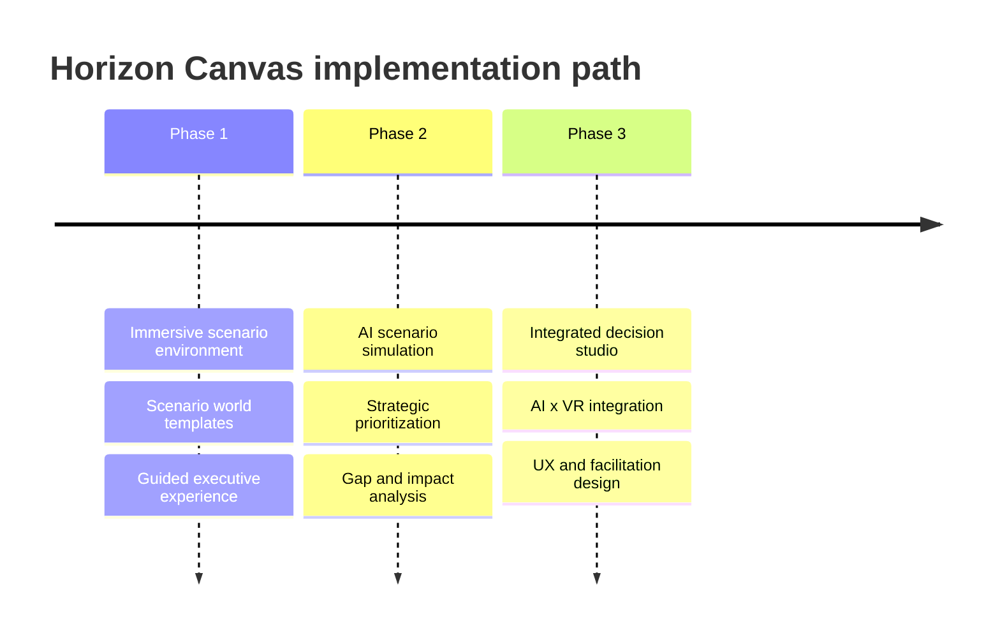

# Horizon Canvas

## AI x VR-Augmented Foresight For Strategic Decision-Making

**Type:** Solution concept  
**Status:** The concept is described at the level of solution architecture, user experience, and method. Implementation details and IP-shaped details are omitted.

## Concept

Horizon Canvas is an AI x VR-augmented foresight concept for executive decision-making.

The idea is simple: strategic scenarios are more useful when leadership teams can experience them and test choices inside them, not only read about them. Horizon Canvas turns scenario work into an immersive decision environment where executives explore alternative futures, identify strategic gaps, test decisions across multiple scenarios, and use AI-supported impact analysis to translate foresight into action.

The concept was developed to tackle a recurring limitation in foresight work: high-quality scenarios can still fail to change executive decisions, due to abstract nature and difficulty visualizing or deeply engaging with the text-based material. The impact of foresight (and by extension, of any conceptual future-oriented material, including in parts, strategy) is often directly limited, or even tied to the stakeholder engagement with the primary material. The impact of foresight can then, in part, be measured by a combination of it's strategic relevance x the primary stakeholder engagement. 

Excellent foresight that manages to directly address and explore the company's strategic environments' primary uncertainties or opportunities, but doesnt find strong stakeholder engagement largely lacks any impact. The same goes for most other strategic analysis or material that requires participants, such as C-suite or other relevant decision-maker, to imagine any type of future or immediate impacts. The engagement-gap can often play a not-insignificant part in the success of any type of future-oriented strategic engagement.  

Horizon Canvas is an adapted take on answering that problem in the context of foresight, presenting a ready solution concept. It borrows conceptually from other fields' solutions on tackling similiar problems, such as decision-simulations and wargames.

- **Foresight methodology** for scenario logic, uncertainty, implications, and strategic adaptation (although the concept is not tied to one established methodology and can be adapted).
- **Gen AI** for strategic analysis: scenario intelligence, strategic dimension mapping, gap analysis, and impact analysis.
- **Constructed VR environments** for immersion, spatial memory, and experiential engagement.
- **Facilitated decision design** to connect the experience back to concrete strategic choices.

## Concept Visual

## The Problem

Traditional foresight often breaks down at the last mile between analysis and action.

Scenario projects produce strong narratives, robust uncertainty analysis, and useful implications, but executive teams may still struggle to internalize what those futures represent or require. Reports and slide decks are time-efficient ways to present information, but they ensuring the information is received at full depth, often leading to weaker engagement with a future context.

Common failure modes:

- Scenarios are consumed superficially and passively.
- Decision-makers engage with only partial, or limited understanding of the material.
- Abstract future conditions fail to translate into current choices or inform decisions.
- Strategic implications remain interesting but operationally distant.
- Leadership teams do not systematically engage to test decisions across futures.
- Existing strategy remains anchored in the present because the alternative futures do not feel concrete enough.

The core problem is often decision engagement, more so than quality of foresight.

## Solution Shape

Horizon Canvas converts scenario work into an immersive experiential environment and simulation.

Rather than treat scenarios as static outputs, the goal is to turn them into interactive environments and spaces. A leadership team enters a facilitated scenario space, experiences the conditions of alternative futures, prioritizes strategic dimensions, and tests decisions against those futures.

The experience is structured around a clear decision flow:

1. **Guided orientation**  
   The team enters the experience with minimal technical friction, optimized across a validated set of hardware. The setup is facilitator-managed so executives can focus on strategy rather than hardware. Significant attention is paid to the UX-design and experience.

2. **Scenario world exploration**  
   Each scenario becomes a spatial environment, divided into a scenario gallery, and keystone moments, representing individual scenes playing out foundational moments from each scenario. The participants experience the scenarios through gallery-like visual spaces, allowing exploration across spatially constructed locations, as well as experiencing lived moments from the scenarios. 

3. **Strategy lab**  
   Strategic choices are tested across multiple futures in a VRxGenAI decision-simulation, in a constructed space. The strategy studio functions as both a way to present the information across multiple dimensions, as well as a space to test those decisions in.   

4. **AI-supported impact analysis**  
   Generative AI structures the implications: positive and negative consequences, assumption dependencies, second-order effects, cross-scenario vulnerabilities, and adaptation options.

5. **Strategic adaptation**  
   The session produces decision inputs: robust moves, contingent moves, warning indicators, capability gaps, and next-step actions.

## User Experience Journey

The journey moves from low-friction orientation into scenario exploration and then into decision testing. The VR layer is not there for spectacle. It gives scenario work a spatial and experiential form, making future conditions easier to remember, discuss, and act on.

## Decision Simulation Method

Horizon Canvas is designed around decision simulation, not only scenario presentation.

The method has three core layers:

1. **Strategic dimension prioritization**  
   The team selects the dimensions most critical to success under uncertainty.

2. **Strategic gap analysis**  
   Immersive scenario engagement helps reveal where current strategy, capabilities, or assumptions become insufficient.

3. **AI impact analysis**  
   Strategic decisions are evaluated across alternative futures, showing where choices produce positive effects, negative consequences, dependencies, and vulnerabilities.

This is the central design move: the immersive environment is connected to a structured strategy method. The output is not simply "people experienced the future." The output is a better understanding of what the organization should protect, change, test, or monitor.

## Architecture

The concept separates the intelligence layer from the experience layer.

### Scenario Methodology

The foundation is established foresight practice: scenario logic, uncertainties, implications, strategic options, and decision support.

### AI Scenario Intelligence Layer

The AI layer handles scenario structuring and analysis. It supports strategic dimension mapping, gap analysis, impact analysis, cross-scenario comparison, and organization-specific adaptation.

### VR Experience Layer

The VR layer translates future worlds into immersive environments. It creates spatial context, guided exploration, scenario galleries, keystone moments, and decision-testing spaces.

### Integration Layer

The integration layer connects scenario content, AI analysis, and immersive experience. Scenario data flows into the VR environment; user choices and decision inputs flow back into the analysis layer.

### Facilitated Decision Experience

The experience is designed as a facilitated executive intervention. The technology supports strategic work; it does not replace the method or the facilitator.

## Why AI And VR Belong Together Here

AI and VR solve different parts of the foresight engagement problem.

AI makes the scenario system adaptive and feasible to construct as part of a regular engagement:

- Agentic development helps structure the worlds, create assets and construct the details of the world
- Voice-based AI enables hands-free engagement as part of the experience
- AI enables the simulation and rapid strategic analysis of the futures and the decision-makers actions, bridging the gap between analysis and feedback. The feedback loop for decisions' impacts drops from weeks to minutes

VR makes the scenario system experiential:

- VR allows us to turns abstract futures into spatial locations and places.
- The experiential nature enables brains' spatial memory and procession - we remember spaces we've visited in significantly more detail than things we've read. 
- It gives leadership teams a shared environment and concretization of the future for discussing uncertainty.

The combination of two layers allows the interactivity that would otherwise be too expensive to craft. VR-based representation alone would lack the feedback loops and require handcrafting most paths, introducing prohibitive development costs and cycles. AI-based scenario or strategic analysis without AI would lose the foundation of the engagement constructed by the VR-spaces, risking the analysis remaining as text-based analysis layer. While both solutions are fully able to stand alone, and dont necessarily need to be entangled (apart from the AI-native development and iteration methods used in the construction and adaption of the worlds), the combination of the two is greater than the sum of it's parts.

## Implementation Path

Horizon Canvas is designed for phased development.

1. **Immersive scenario environment**  
   Build the first scenario world, interaction pattern, visual language, facilitation flow, and content templates.

2. **AI scenario simulation**  
   Add AI-supported strategic prioritization, gap analysis, and decision-impact analysis.

3. **Integrated decision studio**  
   Connect the AI and VR layers into a coherent executive workflow with UX, facilitation design, and reusable outputs.

## Design Principles

### Make Futures Concrete

Scenario work should become easier to experience, remember, and discuss. The point is not visual richness by itself; it is stronger strategic engagement.

### Keep The Method In Charge

The foresight methodoly remains the backbone. AI and VR are used to strengthen the method, not replace it.

### Minimize Technical Friction

The experience should be facilitator-managed and user-oriented, with an eye to accessibility. Users should not have to configure technology or learn complex controls. The technological experience needs to be intuitive and widely accessible.

### Ground AI In Scenario Logic

AI should operate inside the scenario frame. Its job is to structure implications, compare choices, and expose assumptions, not invent disconnected advice.

### Translate Experience Into Decisions

Every immersive moment should connect back to strategic adaptation: what to do, what to monitor, what to test, and what assumptions need to change.

## Example Use Cases

Horizon Canvas fits situations where organizations need to make strategic decisions under uncertainty:

- Stress-testing a new strategy against alternative operating environments.
- Exploring how regulation, geopolitics, technology, or market structure could reshape strategic choices.
- Helping leadership teams internalize customer, stakeholder, or market shifts.
- Testing investment priorities across several futures.
- Supporting public-sector planning where long-term trade-offs are difficult to communicate.
- Translating scenario work into capability, portfolio, or operating-model decisions.

## What The Concept Shows

Horizon Canvas shows one direction for the next generation of foresight practice: moving from scenario communication toward scenario experience and decision simulation.

The concept demonstrates that AI can be used not only to generate foresight content, but to make scenarios more adaptive, organization-specific, and decision-relevant. It also shows how immersive technologies can be used in a serious strategic context when they are tied to a clear method rather than treated as novelty.

The underlying idea is broader than VR. Strategic foresight needs better interfaces for decision-making. Horizon Canvas is one version of that interface: a decision studio where leadership teams can inhabit futures, test choices, and leave with clearer strategic commitments.

## Public Summary

Horizon Canvas is an AI x VR foresight solution concept for executive decision-making. It turns scenario work into an immersive decision studio where leadership teams can experience alternative futures, test strategic choices, and use AI-supported impact analysis to identify robust moves, vulnerabilities, and adaptation needs. The concept combines foresight methodology, generative AI scenario intelligence, VR experience design, and a phased implementation architecture.
