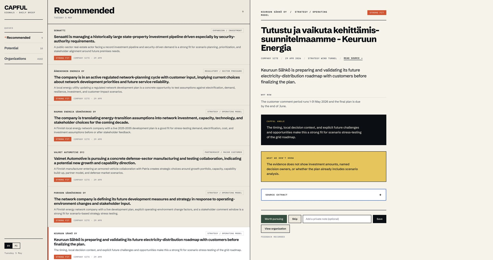

# Sales Signal Engine: From AI Use-Case Discovery To A Production-Shaped Signal Intelligence Pipeline

**Timeline:** The core build, evaluation, cost-optimization, and productionization work ran from 29 April to late May 2026.

**Status:** Capful-owned internal IP. This case study describes the project architecture, development process, and lessons learned without publishing proprietary code, prompts, source lists, or business logic.

> Early UI mockup from the Sales Signal Engine build, using placeholder/example signal data. This predates the final scoring rubrics, evidence filters, and queue calibration; it is included to show the intended product shape: ranked signal queues, expanded source context, rationale, uncertainty notes, and lightweight feedback actions.

## Summary

The Sales Signal Engine was built to solve a practical and common B2B sales problem: commercially relevant signals are usually scattered across company websites, public-sector pages, press releases, reports, meeting materials, and other noisy sources. Monitoring this manually is slow, inconsistent, and rarely done with high rigour. It is also the kind of work where generative AI can be highly useful, provided the task is framed with sufficiently explicit rubrics and review loops.

The project began as an idea surfaced through an internal AI use-case workshop series I ran at Capful. Sales and consulting teams described the difficulty of tracking and identifying relevant sales signals through existing tools. I took that ambiguous problem, reframed it as an AI/data-product architecture challenge, and built a production-shaped pipeline for turning public web evidence into prioritized signal queues.

The core challenge was not scraping websites or producing fluent LLM analysis. The hard problem was defining which pieces of evidence represented real, timely, organization-relevant buying windows; which were adjacent or weak; and which should be discarded.

A short review of existing practice made the problem look less solved than it first appeared. "Sales signal" sounds straightforward, but an unambiguous operational definition is difficult. Practitioners use proxies such as leadership change, funding, hiring, procurement, or strategic announcements, but those proxies are noisy. Researchers and commercial tools do not provide a universal benchmark for consultant-relevant buying-window detection. That meant the project needed to define its own quality standard.

## Origin: Internal AI Use-Case Workshops

The starting point was not a technology demo. It came from structured internal exploration of where AI might create practical value in a consulting firm.

The sales-side problem was simple to state:

- Useful buying signals exist before formal opportunities appear.
- Those signals are distributed across many public sources.
- Existing monitoring practices are fragmented and dependent on individual consultant effort.
- The cost of missing a relevant signal is hard to measure, but the work is clearly valuable when it lands.

I translated this into a product premise:

> If we can monitor a broad public evidence surface, extract concrete organization-level events, and score them through a consultant-specific rubric, we can give consultants a higher-quality view of emerging opportunities than manual monitoring alone.

This framing shaped the rest of the build. The objective was not to summarize public news. The objective was to surface evidence-backed commercial signals early enough to be useful.

## Heavy Proof Of Concept

The first phase was a deliberately heavy proof of concept.

The goal was to validate the central premise:

- Could an LLM identify plausible sales signals from public evidence?
- Could we construct an initial criterion for what sources and events should count?
- Could a queue UI make the results reviewable by consultants?
- Could a frozen initial review set support further iteration and cost optimization?

The early version used broad ingestion, rich evidence payloads, stronger models, generous prompts, manual review, and a simple signal queue. It was not cost-efficient, but cost-efficiency was not the right first constraint. At that point, the key question was whether there was enough signal in the public evidence surface and whether an LLM-mediated process could make it usable.

An initial golden set was built from a frozen slice of the early pipeline. That set became a reference point for later experiments: if a proposed filter or cheaper model removed too many useful examples, it was not acceptable.

## Data Pipeline Architecture

Once the initial shape worked, the work moved toward an end-to-end data pipeline.

The pipeline had to turn messy public web material into structured evidence that could be filtered, scored, audited, and displayed. It included:

- Source discovery and source configuration.
- Company-site and public-sector crawling.
- Raw evidence storage.
- Main-text extraction.
- Source-date and freshness extraction.
- Deduplication and near-duplicate handling.
- Deterministic pre-filtering for obvious non-evidence pages.
- Cheap LLM triage.
- Higher-quality LLM scoring and prose generation.
- Queue assignment for recommended, potential, weak, and rejected items.
- UI display and expanded source details.
- Feedback capture through save, useful/not useful, and review actions.
- Replay and audit tooling for pipeline changes.

The real-world messiness of the input data drove much of the architecture. Public websites include navigation pages, duplicated announcements, feed pages, stale reports, language variants, empty pages, job postings, cookie pages, index pages, and pages that look important but contain no actionable event. The pipeline needed to reduce this mass while preserving the small number of items that might represent real buying windows.

At scale, the system was built around nightly intake on the order of hundreds of thousands of evidence rows. A typical target shape was to reduce roughly 800,000 crawled evidence items through deterministic and AI filters into a much smaller daily queue, on the order of dozens of consultant-reviewable signals.

## Source Expansion

The source surface expanded in stages.

Early versions focused on simpler public web and company/news-style material. Later iterations broadened the intake to include:

- Company websites.
- Public-sector organization websites.
- Press release and announcement surfaces.
- Procurement-adjacent and public registry sources.
- Investor and ownership-related surfaces.
- Long-form documents such as annual reports, quarterly reports, financial statements, and public-sector meeting materials.

Company sites became especially important. Many strategically relevant signals appear first on an organization's own website, often in local language and outside obvious "news" paths. That created a second problem: deciding which parts of thousands of websites deserved recurring crawling.

To solve that, I built a site-curation workflow. The crawler collected URL inventories from company domains, including navigation links, sitemap URLs, feed links, and visible snippets. LLM-assisted curation then selected which URLs looked likely to contain consultant-relevant evidence. The system biased toward recall while allowing later filters to remove low-value material.

This step materially changed the project. It moved from monitoring a bounded source list to maintaining a curated crawl surface across thousands of organizations.

## Defining Quality

The initial criteria were sharpened into explicit rubrics.

Dimensions included:

- **Freshness:** Is the event current enough to act on?
- **Strategic relevance:** Does it involve strategy, operating model, market movement, investment, uncertainty, transformation, regulation, or public-sector planning?
- **Buyer window:** Is there a plausible opening for advisory work now or soon?
- **Reachability:** Is there an identifiable organization and a plausible owner of the issue?
- **Fit:** Does the situation match work the consulting firm credibly does?
- **Timing risk:** Is the opportunity too early, too late, already awarded, or already in delivery?
- **Evidence grounding:** Does the generated output stay tied to what the source actually says?

The central distinction became the difference between "interesting" and "commercially actionable." Many public items are informative but do not create a realistic consulting angle. Others are weak as standalone news but strong as early indicators of a planning window.

The rubric had to support those differences. It also had to support queue design: recommended signals should be precise and scarce, potential signals should be credible near-misses, and weak signals should remain visible for exploration without crowding the main queue.

## Evaluation Harness And LLMOps

The project required constructing our own evaluation system, a typical LLMOps problem in a domain where no off-the-shelf benchmark existed.

The evaluation layer included:

- Golden/protected review sets.
- Silver or near-miss sets.
- Human review packets.
- Model comparisons.
- Prompt comparisons.
- Replay tools for pipeline changes.
- False-negative audits.
- Freshness audits.
- Regression checks against known useful signals.
- Queue calibration for recommended, potential, and weak.
- Periodic expert review of early outputs.

This was one of the most central parts of the project, especially because the input data was noisy and the label boundary was subjective. For long-term validation and improvement, explicit feedback mechanisms were added to the production site, including save and review actions. Regular feedback was also elicited from users to validate whether surfaced items were genuinely useful.

The evaluation work had two purposes. First, it made pipeline changes safer: proposed filters, model substitutions, or prompt changes could be replayed against known examples. Second, it forced the quality definition to become explicit. The system could not improve reliably until "good" had been operationalized.

## Cost And Reliability Optimization

After the proof of concept demonstrated that useful signals existed, the next challenge was cost and reliability.

The early pipeline could rely on stronger models and large payloads. A production-shaped system needed staged processing:

1. Crawl broadly.
2. Store raw evidence.
3. Remove obvious junk and duplicates deterministically.
4. Require or recover freshness evidence.
5. Use cheaper LLM triage for broad filtering.
6. Deduplicate or cluster similar event rows.
7. Send stronger candidates to higher-quality scoring.
8. Use compact output formats where possible.
9. Hold expensive processing queues when model credits or availability were constrained.
10. Keep runs resumable so partial work was not lost.

This moved the system toward a layered intelligence architecture. Expensive model judgment was reserved for rows where cheaper, evidence-preserving stages had already indicated that judgment might matter.

The result was an operating shape where very large public-web intake could be reduced to a manageable consultant queue with infrastructure and model spend in the range of a lightweight internal tool, not a bespoke manual research operation.

## Long-Form Documents

Long-form documents required a separate lane.

Annual reports, quarterly reports, financial statements, investor materials, and public-sector minutes can contain high-value signals, but they behave differently from short web pages. A 100-page report may contain only a few strategically relevant sections. Snippet-only search is often insufficient, especially when relevant sections are expressed through semantically fuzzy language rather than obvious keywords.

The document lane therefore needed a different processing shape:

- Discover documents.
- Fetch the full document when possible.
- Extract usable text.
- Identify potentially relevant sections.
- Triage those sections.
- Publish document-derived observations back into the main evidence queue.

This lane was technically and operationally more difficult than ordinary web evidence. It required different freshness logic, extraction handling, failure tracking, and model-routing discipline.

## Productization

The system was deployed as an internal production-shaped application.

Productization included:

- VPS deployment.
- Basic authentication.
- Scheduled crawler runs.
- Scheduled document processing.
- Daily classification pipeline.
- SQLite-backed storage.
- Health/status endpoints.
- Backup and cleanup jobs.
- Storage expansion.
- Operational logs.
- Pause/resume controls.
- UI queues for recommended, potential, saved, weak, and rejected signals.
- Expanded signal cards with source details, key facts, source summaries, and feedback actions.

The UI was intentionally simple: consultants needed to scan signals quickly, open source context when needed, and provide feedback without turning review into a heavy workflow.

## What The Project Demonstrated

The project demonstrated that AI can make sense of noisy public evidence for sales-signal discovery when the judgment task is defined with sufficiently strong rubrics, feedback loops, and replayable evaluation.

Several broader lessons stood out:

- **Ambiguous business problems can be turned into AI systems if the judgment boundary is made explicit.** The key move was operationalizing "consultant-relevant buying window" into reviewable criteria.
- **Generative AI is powerful for public-evidence sensemaking, but only inside a system that constrains and evaluates it.** The useful output came from the combination of crawling, metadata extraction, deterministic filtering, LLM triage, scoring, human review, and replay.
- **A single practitioner can build a production-level AI/data pipeline quickly with AI-assisted development and agentic coding.** The speed came from using AI not only for text generation, but for coding, testing, debugging, review, analysis, and operational iteration.
- **Frontier models are highly capable engineering and analysis collaborators when given clear directives, end conditions, and verification loops.** The project used AI assistance across software engineering, data analysis, prompt/rubric iteration, and operational diagnosis.
- **Quality in domain-specific LLM systems is a product-design problem as much as a modeling problem.** The hardest work was deciding what should count as useful, constructing review sets, and checking whether changes improved or damaged that standard.
- **Expert feedback remains central.** The system improved through repeated review across different data slices and time periods, not through one-time prompt tuning.
- **Productionizing AI means designing for failure modes.** Model credits, stale data, duplicate evidence, missing dates, extraction failures, long-running jobs, and operational controls all shaped the final system.

The practical result was a pipeline that could ingest very large public evidence volumes, reduce them through a combination of deterministic and AI filters, and present a small set of prioritized signals for expert review.
